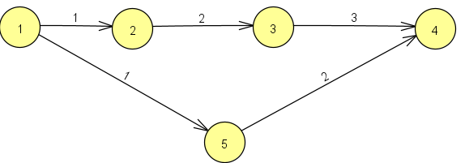
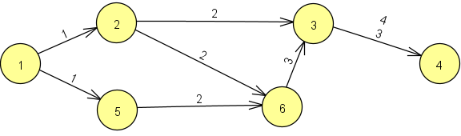

    # NOTAS PARA LOS USUARIOS #

    El proyecto consiste en implementar la estructura de un grafo siguiendo un desarrollo dirigido por pruebas para posteriormente calcular el camino mas corto entre dos vertices:

    Grafo a construir:

    

    Nota: El grafo a representar no es ni ponderado ni dirigido, lo que aparece en la imagen es la cantidad de arcos que tiene que recorrer el nodo anterior(vertice uno) hasta llegar al destino(vertice cuatro), es decir, tiene que recorrer n - 1 arcos, donde n es el numero de nodos para llegar al destino.

    TDD: para comprobar que nuestra practica recorre en anchura cualquier grafo, añado otro test en el cual recorra otro grafo distinto

    

    # INSTRUCCIONES DE USO #

    Este proyecto esta hecho con la herramienta de software Maven:

    *  Compilar: 
    mvn compile
    *  Testear:
    mvn test
    *  Generar javadoc:
    mvn javadoc:javadoc
    *  Generar jar:
    mvn package